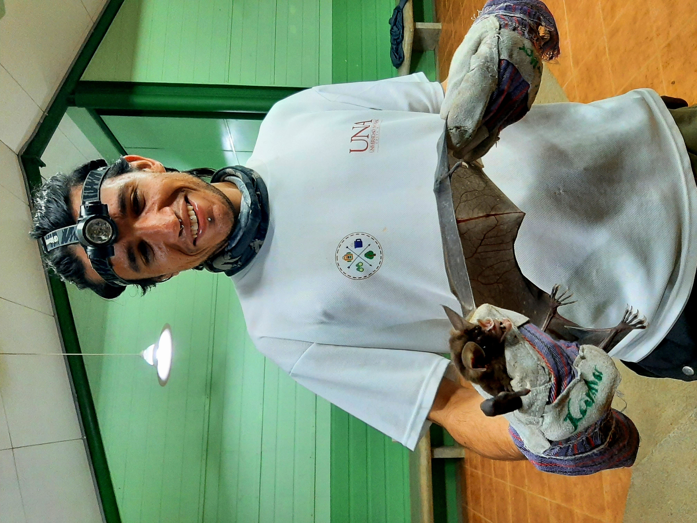

<body style="background-color:black;">

    **Research**

{width=50%}

 

My research is focused on the direct or indirect response of the species to contrasting environments (land-use change, altitudinal gradient, climate change through time), using bats as biological models. I have used several methods such as systematic literature review, macroecological, and phylogenetic methods.

Currently, I'm looking to increase my field experience in tropical forests and get practice in tracking technology as well as molecular methods to study diet.

For my next research, I want to study the effect of habitat disturbance on the movement of neotropical bats, using tracking technology methods in heterogeneous landscapes. In addition to this, I would like to explore the effect of habitat disturbance on ecosystem functions and services provided by neotropical bats (seed dispersion, pollination, and vertebrate and invertebrate predation), using molecular data to study their diet and movement ecology methods to understand their foraging activity in geographical terms.

